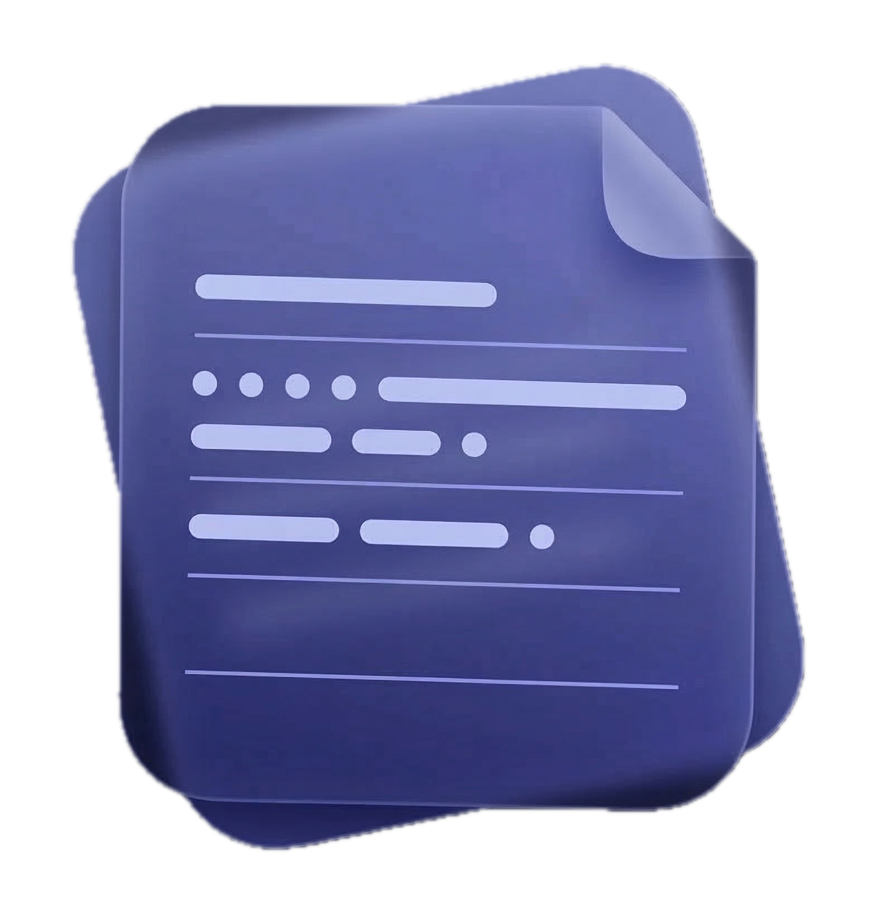

<!-- LOGO -->
<h1>
<p align="center">
  
  <br>Notty
</h1>
  <p align="center">
    A minimal, fast menu bar notepad for macOS.
    <br />
    <a href="#about">About</a>
    ·
    <a href="#install">Install</a>
    ·
    <a href="#features">Features</a>
    ·
    <a href="#build-from-source">Build</a>
  </p>
</p>

## About

Notty is a lightweight notepad that lives in your macOS menu bar.
Click the icon, type your thoughts, close it. Your notes are always
there, always saved, always one click away.

No Dock icon. No window management. No bloat. Just a fast, dark,
floating panel with a monospace editor that stays out of your way
until you need it.

Built with pure Swift and AppKit — no Xcode, no SwiftUI, no dependencies.
Compiled with a single `make` command.

## Install

### Homebrew

```sh
brew tap NovationLabs/notty
brew install notty
```

### Build from source

```sh
git clone https://github.com/NovationLabs/Notty.git
cd Notty
make
make run
```

Requirements: macOS + Xcode Command Line Tools (`xcode-select --install`).

## Features

|  #  | Feature                          | Status |
| :-: | -------------------------------- | :----: |
|  1  | Menu bar icon with open/close    |   ✅   |
|  2  | Dark floating panel              |   ✅   |
|  3  | Monospace text editor            |   ✅   |
|  4  | Auto-save to `~/.notty.txt`      |   ✅   |
|  5  | Corner resize                    |   ✅   |
|  6  | Works over fullscreen apps       |   ✅   |
|  7  | Visible on all Spaces            |   ✅   |
|  8  | Keyboard shortcuts               |   ❌   |
|  9  | Multiple notes / tabs            |   ❌   |
|  10 | Markdown preview                 |   ❌   |

## How it works

Notty runs as a macOS accessory app (`LSUIElement`) — no Dock icon, no
Cmd+Tab entry. It places a small folder icon in the menu bar. Click it
to open a floating panel, click anywhere else to close it.

Notes are persisted to `~/.notty.txt` on every keystroke. There is no
save button. There is no file picker. It just works.

## Stack

- **Language**: Swift
- **Framework**: AppKit (Cocoa)
- **Build**: `swiftc` via Makefile
- **Dependencies**: None
- **Font**: Space Mono (fallback: system monospace)

## License

MIT
